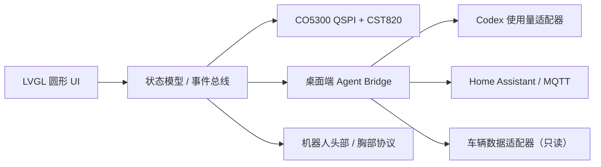

# One Circular Agent

> **ONE 系列 · 一个桌面圆形智能体**

机器人形式不能局限于人形具身，桌面智能体也是一个很好的落地方向。One Circular Agent 是 ONE 系列的第一种形态：用一个 1.73 英寸圆形 AMOLED 作为“脸”或“仪表”，先做出能看、能摸、能联网的桌面设备，再逐步扩展到家居控制、车辆仪表，以及桌面机器人的头部或胸部显示。

> 当前仓库已提供经过实机编译与烧录验证的 ESP-IDF 显示/触摸例程；外壳、桌面端 Agent Bridge 和服务端会按里程碑逐步加入。README 中标为“示例”的接口是建议的数据协议，不代表已经在本仓库实现。

## 可直接烧录的 ESP-IDF 例程

[`example/idf/`](example/idf/README.md) 是 ESP-IDF 例程索引。原厂硬件基准工程是 [`esp32s3-co5300-osptek-lvgl9`](example/idf/esp32s3-co5300-osptek-lvgl9/README.md)，用于验证 CO5300 显示和 CST820 触摸；[`esp32s3-co5300-deepseek-quota`](example/idf/esp32s3-co5300-deepseek-quota/README.md) 提供像素 Agent 表情、Wi-Fi、DeepSeek 余额和柱状历史；[`esp32s3-co5300-grok-agent`](example/idf/esp32s3-co5300-grok-agent/README.md) 提供独立 LVGL blob 表情和余额页，不包含外部受限素材；ONE 的 UI 工程是 [`esp32s3-co5300-agent-watch`](example/idf/esp32s3-co5300-agent-watch/README.md)，运行来自 SquareLine Studio 的 LVGL 9 圆形界面。

- 已在 ESP-IDF `5.5.2`、LVGL `9.4.0`、ESP32-S3（16 MB Flash、8 MB Octal PSRAM）上完成实机编译、烧录和串口启动验证。
- SquareLine 原始设计为 `392x392`，例程会在运行时等比适配到 `466x466` 圆屏。
- 示例只解决屏幕、触摸与 LVGL UI 基础；Codex 用量、Home Assistant/MQTT 和车辆数据应通过桌面端 Agent Bridge 分阶段接入。

首次接线或排查显示异常时，先烧录 [OSPTEK 原厂基准例程](example/idf/esp32s3-co5300-osptek-lvgl9/README.md)；确认显示和触摸正常后，再烧录 [ONE 智能体例程](example/idf/esp32s3-co5300-agent-watch/README.md)。每个例程都在自己的目录中执行 `idf.py set-target esp32s3`、`idf.py build` 和 `idf.py -p <串口> flash monitor`。

## ONE 系列的产品哲学

ONE 系列不把机器人等同于“必须具有人形身体”。一个放在桌面上的圆形智能体，同样可以感知环境、连接服务、表达状态并持续与人协作；它更容易低成本验证，也更适合从软件和 Vibe Coding 开始迭代。

- **先有智能体，再决定身体**：显示头、胸部终端、桌面摆件和车载仪表可以共享同一套状态模型与交互语言。
- **桌面是很好的落地场景**：不需要先解决行走和抓取，就能验证记忆、提醒、家居控制、任务协作和情绪表达。
- **圆形屏幕是 ONE 的第一张脸**：它既能显示信息，也能成为未来机器人外形、声音和动作的统一状态出口。

## 这个项目想解决什么

很多机器人项目一开始就要处理机械结构、运动控制和复杂的语音链路。One Circular Agent 先把问题缩小成一个小而完整的产品：一个放在桌面的圆形智能体。

- **桌面智能体**：时间、天气、番茄钟、通知、音乐和状态卡片。
- **Codex 工作台**：显示经授权的 Codex 使用量/余额、任务状态、构建日志和提醒。
- **智能家居面板**：通过 Home Assistant、MQTT 或本地网关控制灯、空调、窗帘和插座。
- **车辆/汽车仪表盘**：读取速度、电量、续航、胎压等信息；早期只做只读显示，不承担安全关键控制。
- **机器人显示核心**：同一套 LVGL UI 可以装进桌面机器人的头部或胸部，成为表情、状态和交互中心。

## 目标硬件

本 README 以 OSPTEK **AM173Q466466FLS** 模组为参考：1.73 英寸、466×466、AMOLED、CO5300 QSPI 显示、CST820 电容触摸。

| 部件 | 建议 |
| --- | --- |
| 主控 | ESP32-S3，优先选择带 PSRAM、USB 和 Wi-Fi 的开发板 |
| 显示 | OSPTEK 1.73″ 466×466 AMOLED（CO5300，QSPI） |
| 触摸 | CST820，I²C，参考地址 `0x15` |
| UI | LVGL 9（也可使用供应商提供的 LVGL 8 示例） |
| 供电 | 按屏幕和开发板规格提供稳定的 3.3 V；信号不要接 5 V |
| 连接 | 建议使用屏幕配套 QSPI 转接板，不要直接给裸 FPC 飞线 |

屏幕资料：

- [OSPTEK Gitee 资料仓库](https://gitee.com/osptek/1.73-amoled-466x466-qspi-co5300)
- [OSPTEK GitHub 镜像](https://github.com/osptek/1.73-amoled-466x466-qspi-co5300)
- [本项目 GitHub 仓库](https://github.com/anglersking/one-circular-agent)

## 屏幕引脚与 ESP32-S3 参考接线

下面的 GPIO 编号来自 OSPTEK 转接板原理图和其 ESP32-S3 + ESP-IDF 示例，适用于“该转接板 + 对应 ESP32-S3 示例”的起步验证。**GPIO 并不是 CO5300 屏幕的固定引脚**；换主控或换开发板时，只需修改 GPIO 映射，QSPI 信号名称不变。

### 转接板 J1：显示 QSPI

| J1 针脚 | 屏幕信号 | ESP32-S3 示例 GPIO | 用途 |
| ---: | --- | ---: | --- |
| 1 | `LCDTE` / `TE` | GPIO16 | 撕裂同步，可选；不用 TE 时可以悬空并关闭对应配置 |
| 2 | `LCDRST` / `RST` | GPIO15 | CO5300 硬件复位 |
| 3 | `QS_CS` / `CS` | GPIO14 | QSPI 片选 |
| 4 | `QS_IO3` / `D3` | GPIO13 | QSPI 数据 3 |
| 5 | `QS_IO2` / `D2` | GPIO12 | QSPI 数据 2 |
| 6 | `QS_IO1` / `D1` | GPIO11 | QSPI 数据 1 |
| 7 | `QS_IO0` / `D0` | GPIO10 | QSPI 数据 0 |
| 8 | `QS_CLK` / `SCK` | GPIO9 | QSPI 时钟 |

QSPI 模式下没有传统 SPI 的 `MISO/MOSI/DC` 三根独立线；`D0~D3` 都是数据线，`DC` 由 CO5300 QSPI 命令格式处理。不要把它当成普通四线 SPI 来接。

### 转接板 J2：供电与 CST820 触摸

| J2 针脚 | 信号 | ESP32-S3 示例 GPIO | 说明 |
| ---: | --- | ---: | --- |
| 1 | `TP_SCL` | GPIO42 | CST820 I²C 时钟 |
| 2 | `TP_SDA` | GPIO41 | CST820 I²C 数据 |
| 3 | `TP_RST` | GPIO40 | 触摸芯片复位 |
| 4 | `TP_INT` | GPIO39 | 触摸中断，参考示例为低电平有效 |
| 5 | `GPIO38` | — | 转接板引出，屏幕初始化不使用 |
| 6 | `GPIO47` | — | 转接板引出，屏幕初始化不使用 |
| 7 | `GND` | — | 地 |
| 8 | `3V3` | — | 3.3 V 电源 |

### 模组 LCD1 上的已用信号

如果你查看的是裸模组连接器而不是转接板，请按信号名对照：`CLK`、`SIO0`、`SIO1`、`SIO2`、`SIO3`、`CS`、`RST`、`TE`、`TP_SCL`、`TP_SDA`、`TP_RST`、`TP_INT`、`VCC3V3` 和 `GND`。FPC 上其余脚位可能是 NC 或电源内部脚位，**不要根据网络图片猜接法**，以料号 `AM173Q466466FLS` 的规格书和原理图为准。

### 可直接复制的 GPIO 配置

```c
// 仅适用于 OSPTEK 转接板的 ESP32-S3 参考接线；换板请修改这些值
#define LCD_PIN_CS       14
#define LCD_PIN_SCK       9
#define LCD_PIN_D0       10
#define LCD_PIN_D1       11
#define LCD_PIN_D2       12
#define LCD_PIN_D3       13
#define LCD_PIN_RST      15
#define LCD_PIN_TE       16       // 可选

#define TOUCH_PIN_SCL    42
#define TOUCH_PIN_SDA    41
#define TOUCH_PIN_RST    40
#define TOUCH_PIN_INT    39
#define TOUCH_I2C_ADDR   0x15
#define TOUCH_I2C_HZ     400000

#define LCD_WIDTH        466
#define LCD_HEIGHT       466
#define LCD_X_GAP        6        // 供应商 ESP-IDF 示例值
#define LCD_Y_GAP        0
#define LCD_PCLK_HZ      40000000 // 起步值；稳定后再调速
```

第一次点不亮时按这个顺序排查：确认 `3V3/GND`、确认 QSPI `D0~D3` 没有交叉、确认 `CS/RST`、降低像素时钟、最后再排查 LVGL 的旋转和 `x/y gap`。触摸能读到 I²C 但坐标反向时，先在驱动配置中尝试 `swap_xy/mirror_x/mirror_y`，不要改线。

## 软件架构



推荐让 ESP32 只负责显示、触摸和低风险本地交互；需要密钥、登录态或复杂协议的部分放在桌面端 Agent Bridge：

```text
ESP32-S3 + LVGL  <--Wi-Fi/MQTT/HTTP-->  Agent Bridge  <--->  Codex / 家居 / 车辆服务
```

这样做的好处是：换服务不用重新烧录固件，密钥不进入设备，桌面端也更容易用 Python、Node.js 或你喜欢的工具 Vibe Coding。

## 给小白的 30 分钟起步路径

1. 准备 ESP32-S3（带 PSRAM）和屏幕转接板，按上面的 J1/J2 表接线。
2. 安装 [ESP-IDF](https://docs.espressif.com/projects/esp-idf/en/latest/esp32s3/) 和 VS Code Espressif 插件。
3. 先运行 OSPTEK 提供的 [LVGL 9 示例](https://github.com/osptek/1.73-amoled-466x466-qspi-co5300/tree/main/versions/AM173Q466466FLS/examples/esp32s3-idf5_co5300-qspi_esp-lvgl-adapter_lvgl9)，确认“能亮、能触摸”。
4. 把供应商示例复制为本项目的 `firmware/`，保留一个可启动的最小版本，再逐步替换 `lv_demo_widgets()`。
5. 先做一个静态圆形首页，再一次只加入一个数据源：天气 → Home Assistant → Codex 使用量 → 车辆数据。

常用命令：

```bash
idf.py set-target esp32s3
idf.py menuconfig
idf.py build
idf.py -p /dev/cu.usbmodemXXXX flash monitor
```

LVGL 只在自己的任务或锁内更新。不要在 Wi-Fi、MQTT 或 HTTP 回调里直接创建控件；先把数据写入状态模型，再由 LVGL 任务刷新界面。

## Vibe Coding 约定

每次让 AI 改代码时，尽量把上下文说完整：

```text
我使用 ESP32-S3 + PSRAM、ESP-IDF 5.x、LVGL 9、CO5300 QSPI、CST820。
当前接线是 J1: CS14/SCK9/D0~D3=10/11/12/13/RST15，
J2: SCL42/SDA41/RST40/INT39。请只修改 firmware/ui_home.c，
保持 466x466、LVGL 线程安全，并给出编译命令和可能的回滚方式。
```

每个小功能都按“需求 → 最小改动 → 编译 → 烧录 → 拍照/日志 → 再迭代”的循环进行。提交 Issue 或 PR 时附上：主控型号、ESP-IDF/LVGL 版本、GPIO 表、串口日志和屏幕照片。

## 三个数据功能如何落地

### Codex 余额 / 使用量

“余额”取决于账号类型和服务是否提供可用的 usage/billing 接口，设备端不应抓取桌面应用私有页面。建议实现一个本地 `Codex 使用量适配器`，向屏幕提供统一数据：

```json
{
  "remaining": 72,
  "unit": "%",
  "reset_at": "2026-08-20T00:00:00Z",
  "source": "authorized-bridge",
  "stale": false
}
```

若接口不可用，显示“最近一次同步时间”或手动录入值，不要显示伪造的实时余额。任何 API key、Cookie 和登录令牌只放在 Agent Bridge 的安全存储中，不要写进固件、截图或仓库。

### 家电控制

优先接入 Home Assistant 或 MQTT；屏幕发出的是“意图”，网关负责鉴权、设备发现和失败重试。危险设备（燃气、门锁、高功率电器）必须二次确认，并明确显示“指令已发送”和“设备已执行”两种状态。

### 汽车 / 车辆仪表盘

第一阶段只读：速度、电池 SOC、续航、温度和故障码。可以先用模拟 JSON，再接 OBD-II、CAN 网关或车辆厂商允许的接口。不要把这个开源项目当作制动、转向、动力或防盗控制器；上车测试前要有独立的硬件和安全审查。

## 里程碑

- [x] **P0 硬件点亮**：CO5300 显示、CST820 触摸、LVGL 圆形缩放适配；见 [`example/idf/esp32s3-co5300-agent-watch/`](example/idf/esp32s3-co5300-agent-watch/README.md)。
- [ ] **P1 桌面时钟**：时间、天气、亮度、休眠和触摸反馈。
- [ ] **P2 家居卡片**：Home Assistant/MQTT 状态、确认、离线提示。
- [ ] **P3 Agent Bridge**：统一的本地 WebSocket/HTTP 数据协议和日志页。
- [ ] **P4 Codex 卡片**：经授权的使用量、任务状态和同步时间。
- [ ] **P5 机器人外壳**：表情、语音状态、传感器状态和头/胸部安装结构。
- [ ] **P6 车辆只读模式**：模拟数据 → OBD/CAN 网关，加入断连和安全降级。

## 设计原则

- 圆形屏幕优先做环形进度、状态徽章和上下滑动卡片，避免把手机网页硬塞进圆屏。
- 离线时仍能看时间、亮度和最近状态；网络功能显示明确的离线/过期状态。
- 所有长耗时操作异步执行，UI 不阻塞；所有外部数据带时间戳和来源。
- 设备端最小权限、密钥不落盘、默认只读；真实车辆和高风险家电必须有物理或软件二次确认。

## 许可证与第三方资料

本项目沿用仓库中的 **Apache License 2.0**。屏幕、CO5300、CST820 和 LVGL 的名称及资料归各自权利人所有；使用供应商示例时请同时遵守其仓库和组件许可证。

欢迎提交适合新手的教程、接线照片、UI 主题、外壳模型和数据适配器。一个小而可运行的 PR，比一次引入整套复杂框架更容易帮助下一个开发者。
